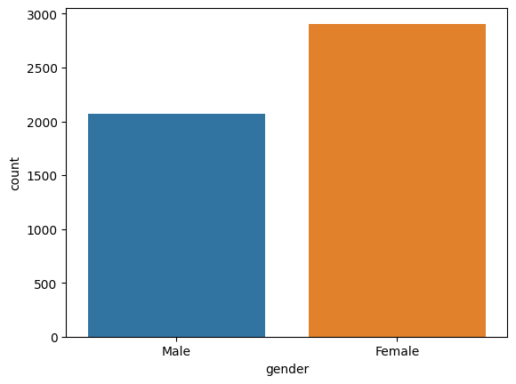

# Laporan Proyek Machine Learning

<table>
<tr>
<td>Nama</td>
<td>:</td>
<td>Suluh Sulistiawan</td>
</tr>
<tr>
<td>NIM</td>
<td>:</td>
<td>211351143</td>
</tr>
<tr>
<td>Kelas</td>
<td>:</td>
<td>Informatika Malam B</td>
</tr>
</table>

## Domain Proyek

Berada dibidang kesehatan dan pencegahan penyakit, dengan fokus pada deteksi risiko stroke pada
individu. Melalui analisis berbagai faktor seperti jenis kelamin, umur, kondisi kesehatan, dan gaya
hidup, proyek ini bertujuan untuk memberikan informasi yang berharga dalam upaya mencegah stroke.

## Business Understanding

Dalam rangka mengatasi beban global stroke, ini bertujuan untuk mengembangkan sebuah mesin prediksi
yang dapat membantu mengidentifikasi individu dengan risiko tinggi terkena stroke.
Dengan memahami berbagai faktor risiko seperti hipertensi, penyakit jantung, dan kebiasaan merokok,
proyek ini diharapkan dapat memberikan kontribusi signifikan dalam pencegahan penyakit stroke.

### Problem Statements

Meskipun banyaknya faktor risiko yang terkait dengan stroke, belum ada solusi prediktif yang
menyeluruh untuk mengidentifikasi individu dengan risiko tinggi secara tepat. Oleh karena itu,
perlu dikembangkan suatu sistem yang mampu memprediksi kemungkinan terjadinya stroke berdasarkan
data yang bersifat personal dan klinis.

### Goals

Tujuan utamanya adalah mengembangkan model prediktif yang akurat untuk mengidentifikasi risiko
stroke pada individu. Dengan demikian, diharapkan dapat meningkatkan deteksi dini, memungkinkan
intervensi yang lebih efektif, dan pada akhirnya mengurangi angka kejadian stroke serta dampaknya
terhadap kesehatan masyarakat.

### Solution statements

Solusi yang diusulkan melibatkan penggunaan teknologi machine learning untuk mengolah dan
menganalisis data yang melibatkan jenis kelamin, umur, kondisi kesehatan, dan faktor-faktor
lainnya. Dengan mengidentifikasi pola dan korelasi antara variabel-variabel ini, diharapkan dapat
dibangun model prediktif yang mampu memberikan peringatan dini dan informasi yang berharga kepada
individu serta profesional kesehatan untuk melakukan tindakan pencegahan yang lebih baik.

## Data Understanding

Dataset "Brain Stroke" ini terdiri dari 11 kolom, menyajikan informasi tentang gejala dan risiko.
Fitur seperti jenis kelamin, usia dan status pernikahan memberikan wawasan terkait risiko stroke
pada populasi yang beragam. Inklusi informasi "Unknown" pada status merokok mencerminkan kenyataan
ketersediaan data. Dataset ini, dengan total hampir 5000 (lima ribu) data/row, memberikan dasar
untuk analisis faktor risiko stroke.

[Brain Stroke Dataset](https://www.kaggle.com/datasets/jillanisofttech/brain-stroke-dataset)

### Variabel-variabel

- **gender** : Jenis kelamin ("Male" dan "Female")
- **age** : Umur `float`
- **hypertension** : Memiliki hipertensi? `boolean`
- **hearth_disease** : Memiliki penyakit jantung? `boolean`
- **ever_married** : Sudah pernah menikah? ("No" dan "Yes")
- **work_type** : Jenis pekerjaan ("Private", "Self-employed", "Govt_job" dan "children")
- **Residence_type** : Tipe tempat tinggal ("Rural" dan "Urban")
- **avg_glucose_level** : Kadar glukosa rata-rata `float`
- **bmi** : Indeks massa tubuh `float`
- **smoking_status** : Seberapa sering merokok ("never smoked", "formerly smoked", "smokes" dan "Unknown")
- **stroke** : Status terkena stroke atau tidak `boolean`

## Data Preparation

Sebelum memulai semuanya, seperti biasa, saya me-_mute_ segala warning yang ada

```py
import warnings
warnings.filterwarnings('ignore')
```

Buat formulir untuk mengunggah file `kaggle.json`

```py
from google.colab import files
files.upload()
```

Letakkan file tersebut pada direktori yang semestinya

```bash
mkdir -p ~/.kaggle
cp kaggle.json ~/.kaggle/
chmod 600 ~/.kaggle/kaggle.json
```

### Import Dataset

Download dataset dan extract ke folder `dataset`

```bash
kaggle datasets download -d jillanisofttech/brain-stroke-dataset
unzip brain-stroke-dataset -d dataset
```

### Import Library

Saya import beberapa library yang kedepannya akan saya gunakan seperti pandas, numpy, matplotlib,
seaborn, dsb

```py
import pandas as pd
import numpy as np
import matplotlib.pyplot as plt
import seaborn as sns
import pickle
from imblearn.over_sampling import SMOTE
from sklearn.model_selection import train_test_split
from sklearn.tree import DecisionTreeClassifier, plot_tree
from sklearn.metrics import confusion_matrix
```

### Data Discovery

Disini saya akan membaca dataset yang sudah di extract menggunakan pandas dan memasukkannya
ke dalam variabel df (dataframe)

```py
df = pd.read_csv('dataset/brain_stroke.csv')
```

Selanjutnya saya perlu mengetahui jumlah fitur dan total data yang ada pada dataset

```py
df.shape
```

Ternyata dataset ini memiliki 11 fitur dan 4981 data/row, selanjutnya saya perlu melihat 4-5 data
pertama untuk mengetahui gambaran data yang ada

```py
df.head()
```

Dan ya, kesimpulan fitur atau variabel-variabel yang ada pada dataset ini sudah dicantumkan
[di sini](#variabel-variabel)

Disini saya akan menganalisis fitur terlebih dahulu, mana yang kategorikal dan mana yang numerikal

```py
df.info()
```

Ternyata `gender`, `hypertension`, `heart_disease`, `ever_married`, `work_type`, `Residence_type`,
`smoking_status` dan `stroke` adalah fitur yang kategorikal. Sedangkan `age`, `avg_glucose_level`
dan `bmi` adalah fitur yang numerikal

Lanjut, saya ingin melihat beberapa ringkasan terkait data numerikal termasuk kategorikal yang
value-nya adalah boolean

```py
df.describe()
```

Dan saya ingin mengecek apakah dataset ini terdapat data yang null?

```py
df.isnull().sum()
```

Ternyata tidak ada sama sekali, bagaimana dengan data yang duplicate?

```py
df.duplicated().sum()
```

Yap, sempurna, tidak ada data yang duplicate

### EDA

Pada tahap ini, hal pertama yang saya perlu lakukan adalah mengecek korelasi antar fiturnya

```py
plt.figure(figsize=(12,10))
sns.heatmap(df.corr(), annot=True, fmt= ".2f")
plt.show()
```


Saya melihat korelasi antar fitur pada dataset ini aman

```py
for col in df.columns:
  if col in ['bmi', 'age', 'avg_glucose_level']:
    continue
  else:
    sns.countplot(data=df, x=col)
    plt.show()
    print()
```

Kode di atas saya gunakan untuk melihat plot untuk semua fitur yang kategorikal




Data-data yang ada tidak cukup balance, saya lanjutkan dulu, lihat kasus yang terkena stroke
berdasarkan gender

```py
stroke_cases = df[df['stroke'] == 1]
plt.pie(stroke_cases['gender'].value_counts(), labels=stroke_cases['gender'].value_counts().index, autopct='%1.1f%%', startangle=90)
plt.show()
```


Jelas tidak balance, untuk yang tidak terkena stroke pun sama

```py
stroke_cases = df[df['stroke'] == 0]
plt.pie(stroke_cases.gender.value_counts(), labels=stroke_cases.gender.value_counts().index, autopct='%1.1f%%', startangle=90)
plt.show()
```


Kemudian berdasarkan status pernikahan

```py
stroke_cases = df[df['stroke'] == 1]
plt.pie(stroke_cases['ever_married'].value_counts(), labels=stroke_cases['ever_married'].value_counts().index, autopct='%1.1f%%', startangle=90)
plt.show()

stroke_cases = df[df['stroke'] == 0]
plt.pie(stroke_cases['ever_married'].value_counts(), labels=stroke_cases['ever_married'].value_counts().index, autopct='%1.1f%%', startangle=90)
plt.show()
```


Lalu, berdasarkan jenis pekerjaan

```py
plt.subplot(1,2,1)
stroke_cases = df[df['stroke'] == 1]
stroke_counts_by_work_type = stroke_cases.groupby('work_type').size()
plt.bar(stroke_counts_by_work_type.index, stroke_counts_by_work_type.values)
plt.xticks(rotation=45)
plt.show()

plt.subplot(1,2,1)
stroke_cases = df[df['stroke'] == 0]
stroke_counts_by_work_type = stroke_cases.groupby('work_type').size()
plt.bar(stroke_counts_by_work_type.index, stroke_counts_by_work_type.values)
plt.xticks(rotation=45)
plt.show()
```


```py
plt.subplot(1,2,1)
stroke_cases = df[df['stroke'] == 1]
stroke_counts_by_Residence_type = stroke_cases.groupby('Residence_type').size()
plt.bar(stroke_counts_by_Residence_type.index, stroke_counts_by_Residence_type.values)
plt.show()

plt.subplot(1,2,1)
stroke_cases = df[df['stroke'] == 0]
stroke_counts_by_Residence_type = stroke_cases.groupby('Residence_type').size()
plt.bar(stroke_counts_by_Residence_type.index, stroke_counts_by_Residence_type.values)
plt.show()
```


Nah, saya melihat untuk data pada fitur tipe tempat tinggal, disini terlihat cukup balance antara
yang Rural (perdesaan) dan Urban (perkotaan), saya lanjutkan

```py
plt.subplot(1,2,1)
stroke_cases = df[df['stroke'] == 1]
stroke_counts_by_smoking_status = stroke_cases.groupby('smoking_status').size()
plt.bar(stroke_counts_by_smoking_status.index, stroke_counts_by_smoking_status.values)
plt.xticks(rotation=45)
plt.show()

plt.subplot(1,2,1)
stroke_cases = df[df['stroke'] == 0]
stroke_counts_by_smoking_status = stroke_cases.groupby('smoking_status').size()
plt.bar(stroke_counts_by_smoking_status.index, stroke_counts_by_smoking_status.values)
plt.xticks(rotation=45)
plt.show()
```

Dan terakhir, berdasarkan status merokok


Karena sedari awal tahap EDA saya sudah merasa curiga dengan ketidak-balance-an data yang ada pada
dataset kali ini, saya akan coba cek kebenarannya

```py
stroke_cases = df.groupby('stroke').count()
stroke_cases['gender'].plot(kind='bar')
xmin, xmax, ymin, ymax = plt.axis()
plt.style.use('ggplot')
plt.show()
```


Ternyata benar, mari lanjut ke preprocessing

### Preprocessing

Saya akan melakukan balancing menggunakan SMOTE, dan pada tahap pertama, saya akan menyesuaikan
lebih dulu fitur yang berisi boolean namun tidak direpresentasikan sebagai boolean, diantaranya
`ever_married` dan `gender`

```py
df['ever_married'] = [ 0 if i !='Yes' else 1 for i in df['ever_married'] ]
df['gender'] = [0 if i != 'Female' else 1 for i in df['gender']]
```

Dengan kode diatas, maka value pada fitur `ever_married` akan berubah 0 jika berisi 'No' dan 1 jika
berisi 'Yes'. Kemudian 0 untuk 'Male' dan 1 untuk 'Female' pada fitur `gender`

Selanjutnya saya perlu mendeklarasikan fitur/kolom yang kategorikal dan membuatnya menjadi perkolom
dengan value boolean menggunakan metode `get_dummies` yang dimiliki pandas

```py
categorical_cols = ['work_type', 'Residence_type', 'smoking_status']
data = pd.get_dummies(df, columns=categorical_cols)
```

Sekarang, waktunya oversampling dengan teknik SMOTE (Synthetic Minority Over-sampling Technique)
untuk melakukan balancing dataset yang ada

```py
Y = data['stroke']
X = data.drop(['stroke'],axis=1)
oversample = SMOTE()
X, Y = oversample.fit_resample(X, Y)
data = pd.concat([X, Y], axis=1)
```

Dan setelah dicek kembali, maka dataset ini sudah balance

```py
df = data.groupby('stroke').count()
df['age'].plot(kind='bar')
xmin, xmax, ymin, ymax = plt.axis()
plt.style.use('ggplot')
plt.show()
```


Terakhir, saya perlu cek kembali korelasinya

```py
plt.figure(figsize=(8, 12))
heatmap = sns.heatmap(data.corr()[['stroke']].sort_values(by='stroke'), vmin=-1, vmax=1, annot=True, cmap='BrBG')
```


Bisa dilihat, ada korelasi yang rendah untuk `hypertension` dan `heart_disease`, ini bisa terjadi,
mungkin karena pengambilan sampelnya yang berlebihan, tapi saya tetap akan menggunakan semua fitur
yang ada

```py
data.to_csv('dataset/final.csv', index=False)
```

Kode diatas saya gunakan untuk meng-export dataset yang sudah di preprocessing, barangkali bisa
digunakan untuk proses kedepannya

## Modeling

Hampir selesai, disini saya melakukan modeling dengan _entropy_, sebelum itu saya coba bagi dataset
menjadi data training dan data testing

```py
X = data.drop(['stroke'], axis=1)
Y = data['stroke']
X_train, X_test, y_train, y_test = train_test_split(X, Y, test_size=.25, random_state=3)
```

Dengan kode diatas, maka saya menggunakan fitur `stroke` untuk variabel targetnya

```py
model = DecisionTreeClassifier(criterion='entropy', random_state=3, max_depth=5)
model.fit(X_train, y_train)
y_pred1 = model.predict(X_test)
```

Proses modeling sudah selesai dan saya perlu test dengan data random

```py
test = np.array([[1, 19, 0, 0, 0, 104.52, 24.4, 0, 1, 0, 0, 0, 1, 0, 0, 1, 0]])
pred = model.predict(test)
'Aman' if pred[0] == 0 else 'Duh'
```

Aman :D

### Visualisasi Hasil Algoritma

```py
plt.figure(figsize=(25,15))
plot_tree(model, feature_names=X_train.columns, class_names='stroke', filled=True)
plt.show()
```


Gambar diatas adalah hasil algoritma yang digunakan untuk proyek ini

## Evaluation

Evaluasi yang akan saya gunakan adalah confussion matrix, ini sangat cocok untuk algoritma
klasifikasi seperti D-Tree ini

```py
cm = confusion_matrix(y_test, y_pred1)
sns.set(rc={'figure.figsize':(11.7,8.27)})
ax = sns.heatmap(cm, annot=True, cmap='Blues', fmt='g')

ax.xaxis.set_ticklabels(['Non Stroke','Stroke'])
ax.yaxis.set_ticklabels(['Non Stroke','Stroke'])

plt.show()

print('Training-set accuracy score:', model.score(X_train, y_train))
print('Test-set accuracy score:', model.score(X_test, y_test))
```


```
Training-set accuracy score: 0.8564586561487534
Test-set accuracy score: 0.8474862695395015
```

Dan ya, sekitar 85% akurasi yang berhasil saya dapatkan, sangat baik

## Deployment


[NeuroInsight Sentinel](https://neuroinsight-sentinel.streamlit.app)
